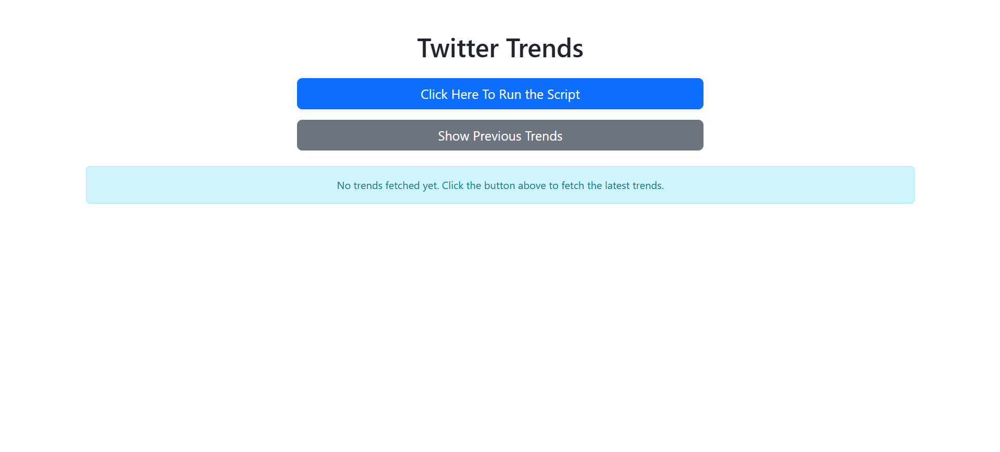
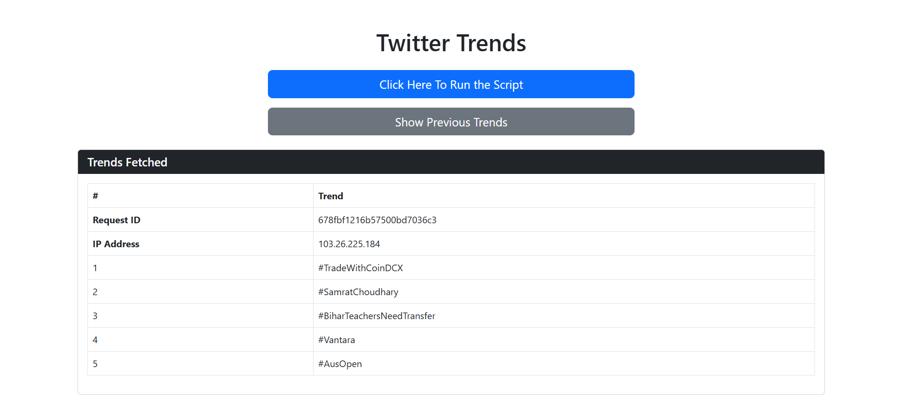
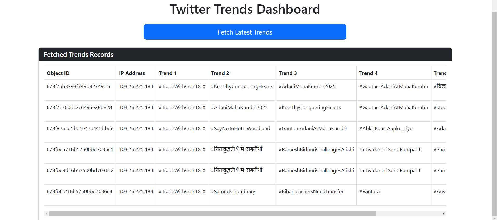

# Twitter Trends Fetcher

A web application that fetches the latest Twitter trends and stores them in MongoDB. Users can view the current trends and access previously fetched trends in a dashboard.

## Features

- Fetch the latest Twitter trends with a simple button click.
- View previously fetched trends from a user-friendly dashboard.
- Store trends in MongoDB along with the user's IP address and timestamp.
- Display trends in an organized table format.

## Technologies Used

- Python
- Flask
- MongoDB
- Requests (for API requests)

## Installation

### 1. Clone the repository

```bash
git clone https://github.com/your-username/your-repository.git
cd your-repository
```

### 2. Install dependencies

Make sure you have Python 3.x installed. Then, install the dependencies listed in the `requirements.txt` file:

```bash
pip install -r requirements.txt
```

### 3. Configure MongoDB

Set up MongoDB. You can either use a local MongoDB instance or MongoDB Atlas. Update the `config.py` file with your MongoDB URI and database credentials.

```python
class Config:
    MONGODB_URI = 'your_mongo_uri_here'
    DB_NAME = 'twitter_trends'
    COLLECTION_NAME = 'trends'
```

### 4. Run the application

To start the Flask application:

```bash
python run.py
```

Visit `http://127.0.0.1:5000/` in your browser to see the app running.

## Usage

- **Fetch Latest Trends**: Click the "Fetch Latest Trends" button to retrieve the latest Twitter trends.
- **View Previous Trends**: Access the dashboard to see the trends that were previously fetched and stored in MongoDB.

## File Structure

```
twitter-trends-fetcher/
│
├── app/
│   ├── __init__.py          # Initialize Flask app
│   ├── config.py            # MongoDB and other configurations
│   ├── routes.py            # Define routes for fetching and displaying trends
│   └── templates/
│       ├── layout.html      # Base layout template
│       ├── fetch_trends.html # Template to fetch trends
│       └── dashboard.html   # Template to display fetched trends
│
├── run.py                   # Entry point for running the app
├── requirements.txt         # List of dependencies
└── README.md                # Project documentation 
``` 

## Screenshots  
Here are some screenshots of the application in action:

1. **Home Page**  
   

2. **Trends Fetched**  
   

3. **Previous Trends**  
   

## Contributing

Feel free to fork this project and submit pull requests. Please follow these steps for contributing:
1. Fork the repository
2. Create a new branch for your feature or bug fix
3. Write tests if necessary
4. Submit a pull request with a detailed explanation of your changes

## License

This project is licensed under the MIT License - see the [LICENSE](LICENSE) file for details.
